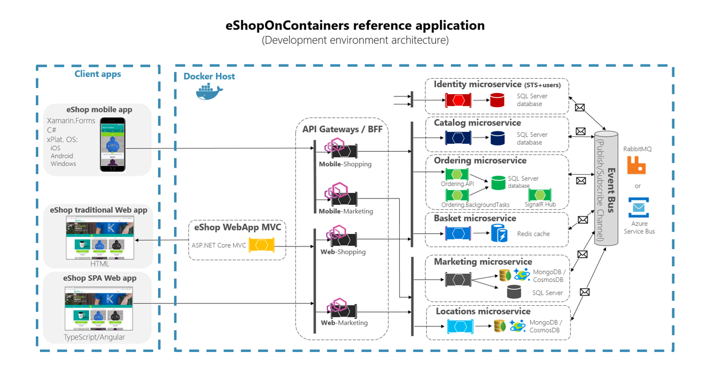
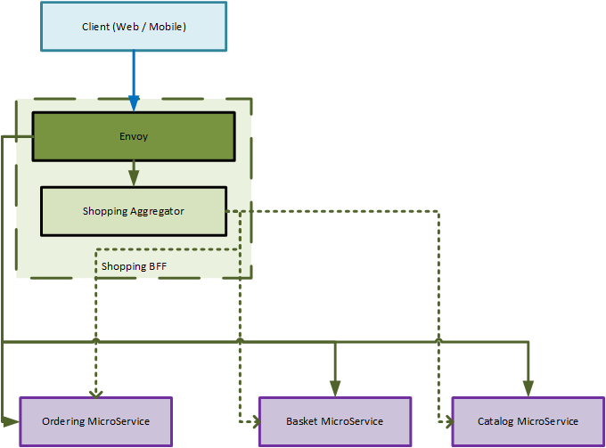
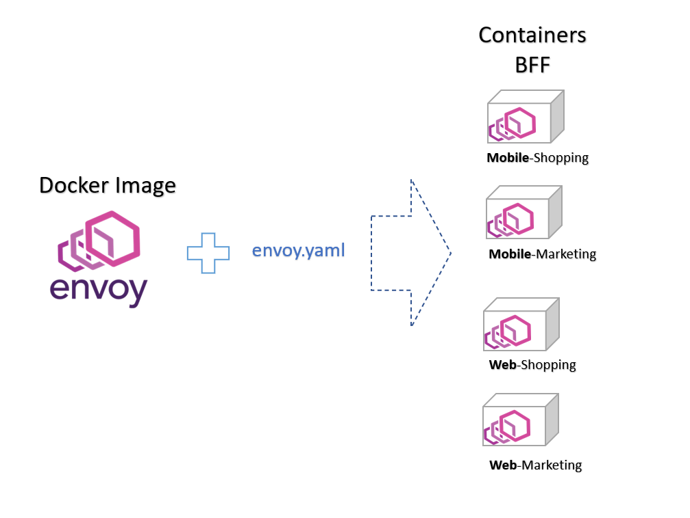
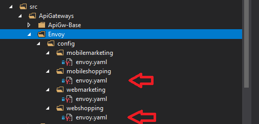
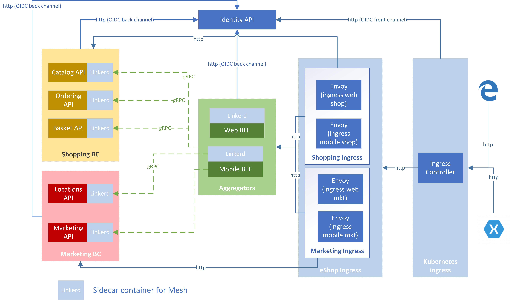

# Implement Service Proxy with Envoy

## Service Proxy

By definition, the term "proxy" is used to refer an intermediary party that represents someone else. The service proxy is of no difference. In an actual deployment scenario, it sits in front of a service and helps in filtering all incoming and outgoing traffic by applying necessary policies.

## Service Proxy Vs API Gateway

Though an API Gateway performs similar functionality to a service proxy, it also supports many robust sets of features. Apart from basic routing, monitoring, rate limiting, it can also offer features like advanced security, comprehensive service orchestration, DoS prevention etc. If you are looking for basic proxy related functionalities for your API, then possibly service proxy is a good place to start. But if your API is not self-sufficient and you are planning to have a full-fledged life cycle for your API with advanced features then API Gateway will be the right choice.


## Choice of Envoy as a service proxy

There are a good number of options available under this segment in [Cloud Native Landscape](https://landscape.cncf.io/category=service-proxy&format=card-mode&grouping=category). But in the `eShopOnContainers` reference application `Envoy` has been picked up as the right choice because of the following reasons. 

- Envoy is a modern, high performance service proxy and imposes a small foot print during deployment.
- It's an open source solution and designed particularly for any cloud-native applications.
- It supports `SSL` for security and has the capability of translating `HTTP/2` to `HTTP/1.1` in both directions of upstream and downstream.
- It's well suited for the large modern service-oriented architectures with functionality like service discovery and load balancing. 
- It gets deployed as a sidecar process and that's the reason it's tied to any service implementation.
- Moreover, it's a no-code solution and can easily be deployed with minimal configuration.

In the initial implementation of the `eShopOnContainers`, Ocelot was used as an API gateway. For more details, you can refer [release 2.2.1](https://github.com/dotnet-architecture/eShopOnContainers/releases/tag/2.2.1). But later in [release 3.0](https://github.com/dotnet-architecture/eShopOnContainers/releases/tag/3.0.0) it had been replaced with Envoy proxy.

## Revised Architecture 

Architecture point of view there is not much of a difference that you have already seen in **Figure 6-28** but the revised one can be seen as per below.



That above architecture diagram shows how the whole application is deployed into a single Docker host or development PC with "Docker for Desktop".

**Figure 6-42**. eShopOnContainers architecture with API Gateways as Envoy proxy

## BFF Pattern with Envoy proxy in eShopOnContainers

[Backends for Frontends (BFF) pattern](https://samnewman.io/patterns/architectural/bff/) was first described by Sam Newman and helps to create separate backend services, which can be consumed by specific frontend applications or interfaces. This pattern is also useful when you want to avoid customizing a single backend for multiple interfaces. 

The current implementation of the BFF in `eShopOnContainers` is shown in the following diagram:



**Figure 6-43**. BFF with Shopping Aggregator

>!Note: This figure only shows one BFF. Each client type (web and mobile) has its own BFF.

The BFF is composed by two containers: One Envoy proxy and one custom aggregator. And in here Envoy proxy acts as ingress for the BFF and provides a single URL for the client. All client calls go through the Envoy proxy. Then, based on some rules, the Envoy proxy can:

- Forward the call to the custom aggregator.
- Forward the call directly to an internal microservice

The custom aggregator is another container, that exposes an HTTP/JSON API and has complex methods, that involves data from various internal microservices. Each method of the custom aggregator calls one (or more) internal microservice, aggregates the results (applying custom logic) and returns data to the client.

All calls from the aggregator to microservices are performed using gRPC (dashed lines in Figure 6-43).

And a client(Web/Mobile) application calls the BFF only through the single URL exposed by the Envoy proxy. Based on the request data, the request is then forwarded to an internal microservice (single crud calls) or to the custom aggregator (complex logic calls), but the overall interaction is transparent to the client.

## Using a single Envoy Docker image to run multiple instances

In `eShopOnContainers`, we're using a single Docker container image of `envoyproxy/envoy` but then, at run time, we create different services proxy containers for each type of API-Gateway/BFF by providing a different `envoy.yaml` configuration file.



**Figure 6-44**. Reusing a single Envoy Docker image across multiple BFF

When deploying as Docker containers, there will be four service proxy containers created from that same Docker image as shown in the following extract from the `docker-compose.yml` file.

```yml

  mobileshoppingapigw:
    image: envoyproxy/envoy:v1.11.1

  mobilemarketingapigw:
    image: envoyproxy/envoy:v1.11.1

  webshoppingapigw:
    image: envoyproxy/envoy:v1.11.1

  webmarketingapigw:
    image: envoyproxy/envoy:v1.11.1

```

Additionally, as you can see in the following `docker-compose.override.yml` file, the only difference between those service proxy containers is the envoy configuration file, which is different for each service container and it's specified at runtime through a Docker volume.

```yml

  mobileshoppingapigw:
    volumes:
      - ./ApiGateways/Envoy/config/mobilemarketing:/etc/envoy
    ports:
    - "5200:80"
    - "15200:8001"

  mobilemarketingapigw:
    volumes:
      - ./ApiGateways/Envoy/config/mobileshopping:/etc/envoy
    ports:
    - "5201:80"
    - "15201:8001"

  webshoppingapigw:
    volumes:
      - ./ApiGateways/Envoy/config/webshopping:/etc/envoy
    ports:
    - "5202:80"
    - "15202:8001"

  webmarketingapigw:
    volumes:
      - ./ApiGateways/Envoy/config/webmarketing:/etc/envoy
    ports:
    - "5203:80"
    - "15203:8001"

```
In `eShopOnContainers`, all Envoy related configurations are kept under the `\src\ApiGateways\Envoy\config` directory and further categorized to cater request from both mobile and web application. As shown in the Visual Studio Explorer below (Figure 6-45) the only file that is needed to define for each business capability, is an envoy yaml file. And during deployment, each service proxy container will use their respective yaml along with the same envoy docker image. 



**Figure 6-45**. Only file needed to define each BFF with Envoy is a configuration yaml file

If you look into one of the `envoy.yaml` (as shown below), you'll notice a standard envoy proxy configuration consists of two primary segments "admin" and "static_resources".
  
  - **admin** is required to configure the administration server.
  - **static_resources** contains all necessary configuration for different services. It actually gets registered through the different *listener filter* where each filter will have its own name and configuration type. 
  In the below yaml only one `HTTP` listener has been configured called `envoy.http_connection_manager`, which has multiple routes configured for different services.
  - It also has an important additional section called **clusters**, which is primarily used for the load balancing for individual backend service.

The detail of each configuration can be found in [Envoy API](https://www.envoyproxy.io/docs/envoy/latest/api/api#api) section. And if you are looking for a few samples, then [envoy example](https://github.com/envoyproxy/envoy/tree/master/examples) in GitHub is the right place.

```yml

admin:
  access_log_path: "/dev/null"
  address:
    socket_address:
      address: 0.0.0.0
      port_value: 8001
static_resources:
  listeners:
  - address:
      socket_address:
        address: 0.0.0.0
        port_value: 80
    filter_chains:
    - filters:
      - name: envoy.http_connection_manager
        config:
          codec_type: auto
          stat_prefix: ingress_http
          route_config:
            name: eshop_backend_route
            virtual_hosts:
            - name: eshop_backend
              domains:
              - "*"
              routes:
              - name: "c-short"
                match:
                  prefix: "/c/"
                route:
                  auto_host_rewrite: true
                  prefix_rewrite: "/catalog-api/"
                  cluster: catalog
              - name: "c-long"
                match:
                  prefix: "/catalog-api/"
                route:
                  auto_host_rewrite: true
                  cluster: catalog
              - name: "o-short"
                match:
                  prefix: "/o/"
                route:
                  auto_host_rewrite: true
                  prefix_rewrite: "/ordering-api/"
                  cluster: ordering
              - name: "o-long"
                match:
                  prefix: "/ordering-api/"
                route:
                  auto_host_rewrite: true
                  cluster: ordering
              - name: "h-long"
                match:
                  prefix: "/hub/notificationhub"
                route:
                  auto_host_rewrite: true
                  cluster: signalr-hub
                  timeout: 300s
                  upgrade_configs:
                    upgrade_type: "websocket"
                    enabled: true
              - name: "b-short"
                match:
                  prefix: "/b/"
                route:
                  auto_host_rewrite: true
                  prefix_rewrite: "/basket-api/"
                  cluster: basket
              - name: "b-long"
                match:
                  prefix: "/basket-api/"
                route:
                  auto_host_rewrite: true
                  cluster: basket
              - name: "agg"
                match:
                  prefix: "/"
                route:
                  auto_host_rewrite: true
                  prefix_rewrite: "/"
                  cluster: shoppingagg
          http_filters:
          - name: envoy.router
          access_log:
          - name: envoy.file_access_log
            filter:
              not_health_check_filter: {}
            config:
              json_format:
                time: "%START_TIME%"
                protocol: "%PROTOCOL%"
                duration: "%DURATION%"
                request_method: "%REQ(:METHOD)%"
                request_host: "%REQ(HOST)%"
                path: "%REQ(X-ENVOY-ORIGINAL-PATH?:PATH)%"
                response_flags: "%RESPONSE_FLAGS%"
                route_name: "%ROUTE_NAME%"
                upstream_host: "%UPSTREAM_HOST%"
                upstream_cluster: "%UPSTREAM_CLUSTER%"
                upstream_local_address: "%UPSTREAM_LOCAL_ADDRESS%"
              path: "/tmp/access.log"
  clusters:
  - name: shoppingagg
    connect_timeout: 0.25s
    type: strict_dns
    lb_policy: round_robin
    hosts:
    - socket_address:
        address: webshoppingagg
        port_value: 80
  - name: catalog
    connect_timeout: 0.25s
    type: strict_dns
    lb_policy: round_robin
    hosts:
    - socket_address:
        address: catalog-api
        port_value: 80
  - name: basket
    connect_timeout: 0.25s
    type: strict_dns
    lb_policy: round_robin
    hosts:
    - socket_address:
        address: basket-api
        port_value: 80
  - name: ordering
    connect_timeout: 0.25s
    type: strict_dns
    lb_policy: round_robin
    hosts:
    - socket_address:
        address: ordering-api
        port_value: 80
  - name: signalr-hub
    connect_timeout: 0.25s
    type: strict_dns
    lb_policy: round_robin
    hosts:
    - socket_address:
        address: ordering-signalrhub
        port_value: 80


```

## Using Kubernetes Ingress with Envoy Proxy

when you are using Kubernetes (*like in an Azure Kubernetes Service cluster*), you usually unify all the HTTP requests through the Kubernetes Ingress tier based on Nginx.

In Kubernetes, if you don't use any ingress approach, then your services and pods have IPs only routable by the cluster network.

But if you use an ingress approach, you'll have a middle tier between the Internet and your services (including your BFFs), acting as a reverse proxy.

As a definition, an Ingress is a collection of rules that allow inbound connections to reach the cluster services. An ingress usually gets configured to provide services externally reachable URLs, load balance traffic, SSL termination and more. Users request ingress by POSTing the Ingress resource to the API server.

When you use the `eShopOnContainers` application in your local development environment with Docker host, you are not using any ingress but only the multiple Envoy proxy acting as API Gateway.

However, when you target a "production" environment based on Kubernetes, `eShopOnContainers` uses an ingress in front of the Envoy proxy(API gateways). That way, the clients still call the same base URL but the requests are routed to multiple API Gateways or BFF.

The following diagram shows the implementation of Ingress Controller with Envoy in `eShopOnContainers`. 



**Figure 6-46**. Ingress controller with Envoy proxy in Kubernetes

In Figure 6-46, the four blue boxes in the column labeled as "eShop Ingress" are the four BFFs. At present, they are implemented using Envoy. Each BFF provides a unique endpoint for its clients and then forwards the call to the specific microservice or the custom aggregator.

It's important to highlight that:

- The communication between BFF and the microservices plus aggregator is HTTP/REST.
- The communication between the aggregators and the microservices is gRPC.


## Additional resources

- **CNCF - List of available service proxy** \
    <https://landscape.cncf.io/category=service-proxy&format=card-mode&grouping=category>

- **Envoy Proxy** \
    <https://www.envoyproxy.io/>

- **Envoy GitHub** \
    <https://github.com/envoyproxy/envoy>

- **Backends for Frontends pattern** \
    <https://docs.microsoft.com/azure/architecture/patterns/backends-for-frontends>

> [!div class="step-by-step"]
> [Previous](implement-api-gateways-with-ocelot.md)
> [Next](../microservice-ddd-cqrs-patterns/index.md)